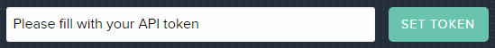

# Preface
This is just a compilation of everything that caught my eye during the challenge.  They could be insignificant or already known but I thought I'd at least give as much feedback as possible.
# General Notes
* When I opened up multiple tabs, prior to dismissing the Packet Bot, the tabs just spammed a blinking title `(2) New Messages` which was a little off-putting.  I dismissed the Bot on one page and then had to do so for each subsequent page.  Nothing crazy, but it was something that caught my eye as a potential annoyance.  I'm not sure how often the Packet Bot comes back so it could very well be a non-issue.
* `Response Body`, **`Request`** and `cURL` sections underneath the endpoints might want to give some affordance that they are blank until you press `Try It`.  I was under the impression they were supposed to be hardcoded examples the first time I expanded them.
* If making a request from the docs with the `Project ID` field populated but the `API Token` blank, the message `Please fill with your API token` is rendered into the input to set your token.  It does not clear the input when it gains focus so you have to delete the message and then enter your API Token.

* Using the `SET TOKEN` button after entering a value in another field clears said value (after setting token).  Kind of a pain, especially because the IDs are UUID, because I have to Alt+Tab to copy it to clipboard again.  It also took me back to the wrong place on the page after setting the token.
* 

# API
